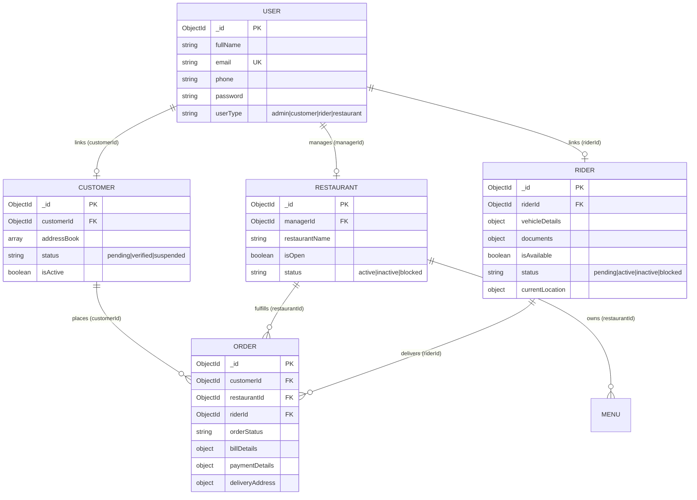

# ADMIN & RIDER BACKEND IMPLEMENTATION DOCUMENTATION
**Project**: Cravings (Full-Stack Food Ordering Platform)  
**Backend Stack**: Node.js, Express.js (v5.2.1, ES Modules), MongoDB, Mongoose, JWT, Cookies, Multer, Cloudinary, Razorpay, Nodemailer.

---

## TABLE OF CONTENTS
1. [Existing Backend Analysis](#1-existing-backend-analysis)
2. [Existing Architecture & Folder Structure](#2-existing-architecture--folder-structure)
3. [Existing Database Models Audit](#3-existing-database-models-audit)
4. [Authentication & Authorization Flow](#4-authentication--authorization-flow)
5. [Existing Order System Analysis](#5-existing-order-system-analysis)
6. [Required Changes & Identified Issues](#6-required-changes--identified-issues)
7. [Rider Architecture Overview](#7-rider-architecture-overview)
8. [Rider Model Specification](#8-rider-model-specification)
9. [Rider Authentication & Authorization](#9-rider-authentication--authorization)
10. [Rider Controllers Specification](#10-rider-controllers-specification)
11. [Rider Routes Map](#11-rider-routes-map)
12. [Rider Middleware](#12-rider-middleware)
13. [Rider Dashboard APIs](#13-rider-dashboard-apis)
14. [Rider Order Lifecycle & State Machine](#14-rider-order-lifecycle--state-machine)
15. [Rider Earnings Architecture](#15-rider-earnings-architecture)
16. [Rider Location Tracking](#16-rider-location-tracking)
17. [Admin Architecture Overview](#17-admin-architecture-overview)
18. [Admin Model & Role Strategy](#18-admin-model--role-strategy)
19. [Admin Authentication & Authorization](#19-admin-authentication--authorization)
20. [Admin Controllers Specification](#20-admin-controllers-specification)
21. [Admin Routes Map](#21-admin-routes-map)
22. [Admin Middleware](#22-admin-middleware)
23. [Admin Dashboard APIs & Metrics](#23-admin-dashboard-apis--metrics)
24. [Customer Management Module](#24-customer-management-module)
25. [Restaurant Management Module](#25-restaurant-management-module)
26. [Rider Management Module](#26-rider-management-module)
27. [Order Management Module](#27-order-management-module)
28. [Rider Assignment System](#28-rider-assignment-system)
29. [Database Entity Relationship Diagrams](#29-database-entity-relationship-diagrams)
30. [Data Validation Rules](#30-data-validation-rules)
31. [Error Handling & Response Standards](#31-error-handling--response-standards)
32. [Security Audit & Vulnerability Fixes](#32-security-audit--vulnerability-fixes)
33. [Required Project File Structure](#33-required-project-file-structure)
34. [Master API Reference Table](#34-master-api-reference-table)
35. [Thunder Client Step-by-Step Testing Guide](#35-thunder-client-step-by-step-testing-guide)
36. [Final Implementation Sequence & Roadmap](#36-final-implementation-sequence--roadmap)

---

## 1. Existing Backend Analysis

The Cravings backend is constructed using **Node.js** and **Express.js v5.2.1** in **ES Module mode** (`"type": "module"`). It connects to **MongoDB** via **Mongoose v9.7.3**, stores assets on **Cloudinary v2**, processes payments through **Razorpay v2.9.8**, and dispatches transactional emails via **Nodemailer v9.0.3**.

### Core Technical Pillars:
* **Server Framework**: Express 5.2.1 with native async route handling, JSON body parser, and Cookie Parser.
* **Security & Auth**: JWT tokens stored in HTTP-Only cookies (`oreo` for sessions, `kitkat` for password reset OTP verification). Passwords encrypted using bcrypt (10 salt rounds).
* **Media Management**: Multer handles memory buffer uploads, forwarded to Cloudinary via base64 data URIs.
* **Separation of Concerns**: Central `User` collection manages identity credentials, while profile-specific collections (`customers`, `restaurants`, `riders`) manage domain-specific datasets and link back via foreign keys.

---

## 2. Existing Architecture & Folder Structure

```
d:\cravings_original\server\
├── index.js                           # Express entrypoint, middleware chain & port binding
├── package.json                       # Dependencies, scripts ("dev", "seed")
├── restaurant-api-documentation.md    # Restaurant API specifications
└── src/
    ├── config/
    │   ├── cloudinary.config.js       # Cloudinary v2 SDK configuration
    │   ├── dbConnection.config.js     # Mongoose MongoDB connection string
    │   └── email.config.js            # Nodemailer transport with Gmail credentials
    ├── controller/
    │   ├── auth.controller.js         # Register, Login, Logout, Send/Verify OTP, Reset Password
    │   ├── common.controller.js       # User Profile edit, Password change
    │   ├── customer.controller.js     # Address Book CRUD, Customer Order retrieval
    │   ├── order.controller.js        # Customer Order creation & bill calculation
    │   ├── payment.controller.js      # Razorpay order generation & signature verification
    │   ├── public.controller.js       # Contact form, public restaurant & menu listings
    │   └── restaurant.controller.js   # Restaurant info, docs, menu CRUD, open/close status
    ├── middleware/
    │   └── auth.middelware.js         # AuthProtect, OTPAuthProtect, RestaurantAuthProtect
    ├── models/
    │   ├── contact.model.js           # Contact us inquiries
    │   ├── customer.model.js          # Customer profile & address book subdocuments
    │   ├── menu.model.js              # Restaurant menu items with categorization
    │   ├── order.model.js             # Order model (items, bill, payment, status)
    │   ├── otp.model.js               # Hashed OTPs with 5-minute TTL
    │   ├── restaurant.model.js        # Restaurant profile, legal, banking, operating hours
    │   ├── rider.model.js             # Rider profile, vehicle, docs, availability, coordinates
    │   └── user.model.js              # Base user credentials, photo, userType enum
    ├── router/
    │   ├── admin.route.js             # [0 Bytes - Empty]
    │   ├── auth.route.js              # /auth routes
    │   ├── common.route.js            # /common routes
    │   ├── customer.route.js          # /customer routes
    │   ├── order.route.js             # /order routes
    │   ├── payment.route.js           # /payment routes
    │   ├── public.route.js            # /public routes
    │   ├── restaurant.route.js        # /restaurant routes
    │   └── rider.route.js             # [0 Bytes - Empty]
    ├── seeders/
    │   ├── admin.seed.js              # Seeds Admin user (admin@cravings678.com)
    │   ├── seed.js                    # Seeder runner
    │   └── user.seed.js               # Seeds restaurant manager, customer, and rider
    └── utils/
        ├── auth.service.js            # JWT signing & cookie generator (oreo, kitkat)
        ├── email.service.js           # OTP email HTML template & mail dispatcher
        └── image.service.js           # Cloudinary buffer upload/destroy utilities
```

---

## 3. Existing Database Models Audit

### 1. `User` (`src/models/user.model.js`)
* **Collection**: `users` (Model: `"user"`)
* **Fields**:
  * `fullName`: `String` (Required)
  * `email`: `String` (Required, Unique, Indexed)
  * `phone`: `String` (Required)
  * `dob`: `Date` (Required)
  * `gender`: `String` (Required)
  * `password`: `String` (Required, bcrypt hash)
  * `photo`: `{ url: String (Required), publicId: String }`
  * `userType`: `String` (Required, Enum: `["admin", "customer", "rider", "restaurant"]`, Default: `"customer"`)
  * `timestamps`: `true` (`createdAt`, `updatedAt`)

### 2. `Customer` (`src/models/customer.model.js`)
* **Collection**: `customers` (Model: `"customer"`)
* **Fields**:
  * `customerId`: `ObjectId` (Required, Ref: `"user"`)
  * `addressBook`: Array of subdocs `{ name, address, city, state, pinCode, country, addressType: enum["home", "work", "other"], isDefault: Boolean, geoLocation: { lat, lon } }`
  * `status`: `String` (Enum: `["pending", "verified", "suspended"]`, Default: `"pending"`)
  * `isActive`: `Boolean` (Default: `true`)
  * `timestamps`: `true`

### 3. `Restaurant` (`src/models/restaurant.model.js`)
* **Collection**: `restaurants` (Model: `"restaurant"`)
* **Fields**:
  * `managerId`: `ObjectId` (Required, Ref: `"user"`)
  * `restaurantName`: `String` (Required)
  * `address`, `city`, `state`, `pinCode`, `country`: `String`
  * `geoLocation`: `{ lat: String, lon: String }`
  * `legal`: `{ legalName: String, companyType: String }`
  * `documents`: `{ gstCertificate: String, fssaiCertificate: String, panCard: String }`
  * `financialDetails`: `{ bankName: String, accountNumber: String, ifscCode: String }`
  * `contactDetails`: `{ email: String, phone: String }`
  * `servingHours`: `{ openingTime: String, closingTime: String }`
  * `isOpen`: `Boolean` (Default: `false`)
  * `status`: `String` (Enum: `["active", "inactive", "blocked"]`, Default: `"inactive"`)
  * `averageRating`: `Number` (Default: `0`)
  * `cuisinesTypes`: `[String]` (Required)
  * `restaurantImage`: `[{ url: String, publicId: String }]`
  * `coverImage`: `{ url: String, publicId: String }`
  * `description`: `String` (Required)
  * `restaurantType`: `String` (Enum: `["veg", "non-veg", "jain", "vegan", "both"]`, Required)
  * `socialMediaLinks`: `[{ platform: String, url: String }]`
  * `timestamps`: `true`

### 4. `Rider` (`src/models/rider.model.js`)
* **Collection**: `riders` (Model: `"rider"`)
* **Fields**:
  * `riderId`: `ObjectId` (Required, Ref: `"user"`)
  * `vehicleDetails`: `{ vehicleType: String, vehicleNumber: String, vehicleModel: String, vehicleColor: String }`
  * `documents`: `{ drivingLicense: String, vehicleRegistrationCertificate: String, insuranceCertificate: String, aadharCard: String, panCard: String }`
  * `currentAddress`: `{ address: String, city: String, state: String, pinCode: String, country: String }`
  * `status`: `String` (Enum: `["active", "inactive", "blocked"]` ➔ **Update to `["pending", "active", "inactive", "blocked"]`**)
  * `averageRating`: `Number` (Default: `0`)
  * `isAvailable`: `Boolean` (Default: `false`)
  * `financialDetails`: `{ bankName: String, accountNumber: String, ifscCode: String }`
  * `currentLocation`: `{ lat: String, lon: String }`
  * `timestamps`: `true`

### 5. `Order` (`src/models/order.model.js`)
* **Collection**: `orders` (Model: `"order"`)
* **Fields**:
  * `restaurantId`: `ObjectId` (Required, Ref: `"restauarnt"` ⚠️ **Bug: Update to `"restaurant"`**)
  * `customerId`: `ObjectId` (Required, Ref: `"customer"`)
  * `riderId`: `ObjectId` (Optional, Ref: `"rider"`)
  * `orderItems`: `[{ itemId: ObjectId, itemName: String, itemPrice: String, quantity: String, image: { url, publicId } }]`
  * `orderStatus`: `String` (Enum: `["pending", "accepted", "preparing", "ready", "pickedUp", "outForDelivery", "undeliverable", "delivered", "cancelled", "failed", "rejected"]`, Default: `"pending"`)
  * `rating`: `Number` (Min: 1, Max: 5)
  * `billDetails`: `{ totalAmount: Number, platformFee: Number, convenienceFee: Number, taxAmount: Number, deliveryCharge: Number, discountAmount: Number, finalAmount: Number }`
  * `deliveryAddress`: `{ name: String, address: String, state: String, city: String, pinCode: String, geoLocation: { lat: String, lon: String } }`
  * `paymentDetails`: `{ paymentMethod: enum["card", "upi"], paymentStatus: enum["pending", "completed", "failed"], razorpayOrderId: String, razorpayPaymentId: String, razorpaySignature: String, paidAt: Date }`
  * `timestamps`: `true`

### 6. `Menu` (`src/models/menu.model.js`)
* **Collection**: `menus` (Model: `"menu"`)
* **Fields**:
  * `restaurantId`: `ObjectId` (Required, Ref: `"restaurant"`)
  * `menuItems`: `[{ itemName: String, itemPrice: Number, description: String, category: Enum[...], foodType: Enum[...], status: Enum["available", "unavailable", "discontinued"], image: { url, publicId }, isTopRated: Boolean, isRecommended: Boolean, isNew: Boolean, isDeleted: Boolean }]`
  * `timestamps`: `true`

---

## 4. Authentication & Authorization Flow

```
[ CLIENT REQUEST ]
        │
        ▼ POST /auth/login { email, password }
[ CONTROLLER ] User.findOne({ email }) ➔ bcrypt.compare(password, user.password)
        │
        ▼ Token Signed: jwt.sign({ id: user._id }, JWT_SECRET, { expiresIn: '1d' })
[ COOKIE SET ] res.cookie("oreo", token, { httpOnly: true, sameSite: "lax", maxAge: 24h })
        │
        ▼ Response 200 OK (Sanitized User Object without password)
================================================================================
[ PROTECTED API REQUEST ] (e.g. GET /admin/dashboard or GET /rider/orders)
        │
        ▼ Cookie Parser extracts req.cookies.oreo
[ MIDDLEWARE: AuthProtect ]
        │ jwt.verify(token, JWT_SECRET) ➔ User.findById(decode.id)
        │ req.user = verifiedUser
        ▼
[ ROLE CHECK MIDDLEWARE ]
   ├── AdminAuthProtect  ➔ verifies req.user.userType === "admin"     (403 if invalid)
   ├── RiderAuthProtect  ➔ verifies req.user.userType === "rider"     (403 if invalid)
   └── RestaurantAuthProtect ➔ verifies req.user.userType === "restaurant" (403 if invalid)
        │
        ▼
[ TARGET CONTROLLER ACTION ]
```

---

## 5. Existing Order System Analysis

1. **Creation**: Customer calls `POST /order/create-order/:restaurantId`. The system checks `req.user.userType === "customer"`, fetches `Customer` document (`customerId: req.user._id`), verifies items and prices against `Menu`, calculates item sum, platform fee (₹5), convenience fee (₹5), delivery charge (₹0), tax (5%), and creates `Order` with `orderStatus: "pending"`.
2. **Payment Verification**: Customer pays via Razorpay modal and posts to `POST /payment/verify`. The HMAC-SHA256 signature is verified. Upon match, `paymentDetails.paymentStatus = "completed"` and `orderStatus = "accepted"`.
3. **Missing Segments**:
   * Restaurant live order feed and transition to `preparing` and `ready`.
   * Admin order visibility and manual Rider assignment (`order.riderId = rider._id`).
   * Rider order lifecycle execution (`pickedUp` → `outForDelivery` → `delivered`).

---

## 6. Required Changes & Identified Issues

1. **Fix `order.model.js` Typo**: Line 6 contains `ref: "restauarnt"`. Fix to `ref: "restaurant"` so `.populate("restaurantId")` operates without throwing schema errors.
2. **Fix Password Leak**: In [auth.controller.js](file:///d:/cravings_original/server/src/controller/auth.controller.js#L92), sanitize `existingUser.password = undefined` before sending `res.json`.
3. **Fix Cookie Clear Casing**: In [auth.controller.js](file:///d:/cravings_original/server/src/controller/auth.controller.js#L102), replace `res.clearCookie("Oreo")` with lowercase `res.clearCookie("oreo")`.
4. **Fix Utility Throw**: In [auth.service.js](file:///d:/cravings_original/server/src/utils/auth.service.js#L20), replace `throw next(error)` with `throw error`.
5. **Fix Error Forwarding**: Replace `catch(error) { next(); }` with `catch(error) { next(error); }` across controllers.
6. **Extend Rider Status Enum**: Add `"pending"` to `rider.model.js` `status` enum.
7. **Add Missing Role Middlewares**: Add `AdminAuthProtect` and `RiderAuthProtect` in [auth.middelware.js](file:///d:/cravings_original/server/src/middleware/auth.middelware.js).

---

## 7. Rider Architecture Overview

```
                      ┌────────────────────────────┐
                      │    Rider Authentication    │
                      │  POST /auth/login (oreo)   │
                      └─────────────┬──────────────┘
                                    │
                                    ▼
                      ┌────────────────────────────┐
                      │      RiderAuthProtect      │
                      │  (req.user.userType=rider) │
                      └─────────────┬──────────────┘
                                    │
         ┌──────────────────────────┼──────────────────────────┐
         ▼                          ▼                          ▼
┌──────────────────┐      ┌──────────────────┐      ┌──────────────────┐
│ Profile & Status │      │ Order Management │      │ Dashboard & Pay  │
│ - Upload Docs    │      │ - View Assigned  │      │ - Daily Earnings │
│ - Vehicle Info   │      │ - Accept Order   │      │ - Total Earnings │
│ - Toggle Online  │      │ - Pickup Order   │      │ - Delivery Count │
│ - GPS Location   │      │ - Deliver Order  │      │ - Rating Summary │
└──────────────────┘      └──────────────────┘      └──────────────────┘
```

---

## 8. Rider Model Specification

```javascript
// src/models/rider.model.js
import mongoose from "mongoose";

const RiderSchema = mongoose.Schema(
  {
    riderId: {
      type: mongoose.Schema.Types.ObjectId,
      ref: "user",
      required: true,
      unique: true,
    },
    vehicleDetails: {
      vehicleType: { type: String, default: "" },
      vehicleNumber: { type: String, default: "" },
      vehicleModel: { type: String, default: "" },
      vehicleColor: { type: String, default: "" },
    },
    documents: {
      drivingLicense: { type: String, default: "" },
      vehicleRegistrationCertificate: { type: String, default: "" },
      insuranceCertificate: { type: String, default: "" },
      aadharCard: { type: String, default: "" },
      panCard: { type: String, default: "" },
    },
    currentAddress: {
      address: { type: String, default: "" },
      city: { type: String, default: "" },
      state: { type: String, default: "" },
      pinCode: { type: String, default: "" },
      country: { type: String, default: "India" },
    },
    status: {
      type: String,
      enum: ["pending", "active", "inactive", "blocked"],
      default: "pending",
    },
    averageRating: { type: Number, default: 5.0, min: 0, max: 5 },
    isAvailable: { type: Boolean, default: false },
    financialDetails: {
      bankName: { type: String, default: "" },
      accountNumber: { type: String, default: "" },
      ifscCode: { type: String, default: "" },
    },
    currentLocation: {
      lat: { type: String, default: "" },
      lon: { type: String, default: "" },
    },
  },
  { timestamps: true }
);

const Rider = mongoose.model("rider", RiderSchema);
export default Rider;
```

---

## 9. Rider Authentication & Authorization

* **Single Unified Auth**: Riders register via `POST /auth/register` with `userType: "rider"` and login via `POST /auth/login`.
* **Automatic Profile Creation**: On registration or initial profile access, a `Rider` profile record is linked via `riderId: user._id`.
* **Access Control**: Every endpoint under `/rider/*` requires `RiderAuthProtect`. If `req.user.userType !== "rider"`, the server returns `403 Forbidden`.

---

## 10. Rider Controllers Specification

Located in `src/controller/rider.controller.js`:

1. **`GetRiderProfile(req, res, next)`**: Finds `Rider.findOne({ riderId: req.user._id })`. Returns profile, vehicle info, and documents.
2. **`UpdateRiderProfile(req, res, next)`**: Updates vehicle details, address, and bank info.
3. **`UploadRiderDocuments(req, res, next)`**: Accepts `multipart/form-data` for `drivingLicense`, `vehicleRC`, `insurance`, `aadharCard`, `panCard`, uploads buffers to Cloudinary, and updates URLs.
4. **`ToggleRiderAvailability(req, res, next)`**: Toggles `isAvailable` between `true` and `false`. Throws `400` if `status !== "active"`.
5. **`UpdateRiderLocation(req, res, next)`**: Updates `currentLocation: { lat, lon }`.
6. **`GetRiderOrders(req, res, next)`**: Queries `Order.find({ riderId: rider._id })` with optional query `?status=active|completed|all`.
7. **`GetRiderOrderDetails(req, res, next)`**: Queries `Order.findOne({ _id: orderId, riderId: rider._id })`, populated with customer address and restaurant contact info.
8. **`AcceptAssignedOrder(req, res, next)`**: Confirms order assignment.
9. **`PickupOrder(req, res, next)`**: Validates order state (`ready` or `accepted`), transitions status to `pickedUp`.
10. **`OutForDeliveryOrder(req, res, next)`**: Validates order state is `pickedUp`, transitions to `outForDelivery`.
11. **`DeliverOrder(req, res, next)`**: Validates order state is `outForDelivery`, transitions to `delivered`.
12. **`MarkOrderUndeliverable(req, res, next)`**: Sets `orderStatus = "undeliverable"`.
13. **`GetRiderEarnings(req, res, next)`**: Computes delivery fees (₹40 per delivered order) for today and lifetime.
14. **`GetRiderDashboard(req, res, next)`**: Aggregates active deliveries count, completed count, today's earnings, rating, and online status.

---

## 11. Rider Routes Map

Mounted at `/rider` in `src/router/rider.route.js`:

```javascript
import express from "express";
import multer from "multer";
import { RiderAuthProtect } from "../middleware/auth.middelware.js";
import {
  GetRiderProfile,
  UpdateRiderProfile,
  UploadRiderDocuments,
  ToggleRiderAvailability,
  UpdateRiderLocation,
  GetRiderOrders,
  GetRiderOrderDetails,
  AcceptAssignedOrder,
  PickupOrder,
  OutForDeliveryOrder,
  DeliverOrder,
  MarkOrderUndeliverable,
  GetRiderEarnings,
  GetRiderDashboard,
} from "../controller/rider.controller.js";

const upload = multer();
const router = express.Router();

router.use(RiderAuthProtect);

// Profile, Status & Coordinates
router.get("/profile", GetRiderProfile);
router.put("/profile", UpdateRiderProfile);
router.put(
  "/upload-documents",
  upload.fields([
    { name: "drivingLicense", maxCount: 1 },
    { name: "vehicleRC", maxCount: 1 },
    { name: "insurance", maxCount: 1 },
    { name: "aadharCard", maxCount: 1 },
    { name: "panCard", maxCount: 1 },
  ]),
  UploadRiderDocuments
);
router.patch("/toggle-availability", ToggleRiderAvailability);
router.patch("/location", UpdateRiderLocation);

// Dashboard & Financials
router.get("/dashboard", GetRiderDashboard);
router.get("/earnings", GetRiderEarnings);

// Deliveries
router.get("/orders", GetRiderOrders);
router.get("/orders/:orderId", GetRiderOrderDetails);
router.patch("/orders/:orderId/accept", AcceptAssignedOrder);
router.patch("/orders/:orderId/pickup", PickupOrder);
router.patch("/orders/:orderId/out-for-delivery", OutForDeliveryOrder);
router.patch("/orders/:orderId/deliver", DeliverOrder);
router.patch("/orders/:orderId/undeliverable", MarkOrderUndeliverable);

export default router;
```

---

## 12. Rider Middleware

```javascript
export const RiderAuthProtect = async (req, res, next) => {
  try {
    const token = req.cookies.oreo;
    if (!token) {
      const error = new Error("Session Expired");
      error.statusCode = 401;
      return next(error);
    }
    const decode = await jwt.verify(token, process.env.JWT_SECRET);
    const verifiedUser = await User.findById(decode.id);
    if (!verifiedUser) {
      const error = new Error("Session Expired");
      error.statusCode = 401;
      return next(error);
    }
    if (verifiedUser.userType !== "rider") {
      const error = new Error("Unauthorized Access: Rider role required");
      error.statusCode = 403;
      return next(error);
    }
    req.user = verifiedUser;
    next();
  } catch (error) {
    next(error);
  }
};
```

---

## 13. Rider Dashboard APIs

### `GET /rider/dashboard`
* **Response Body (`200 OK`)**:
```json
{
  "message": "Rider dashboard statistics fetched successfully",
  "data": {
    "isAvailable": true,
    "status": "active",
    "averageRating": 4.9,
    "activeOrdersCount": 1,
    "todayDeliveriesCount": 6,
    "totalDeliveriesCount": 54,
    "todayEarnings": 240,
    "totalEarnings": 2160
  }
}
```

---

## 14. Rider Order Lifecycle & State Machine

```
   [ READY / ASSIGNED ]
            │
            ▼ (PATCH /rider/orders/:id/pickup)
      [ PICKED_UP ]
            │
            ▼ (PATCH /rider/orders/:id/out-for-delivery)
   [ OUT_FOR_DELIVERY ]
            │
            ▼ (PATCH /rider/orders/:id/deliver)
       [ DELIVERED ]
            │
            └─────────► [ UNDELIVERABLE ] (If customer unreachable/address issue)
```

### Transition Validation Rules:
* Cannot pickup an order unless `orderStatus` is `"ready"` or `"accepted"`.
* Cannot set `outForDelivery` unless `orderStatus` is `"pickedUp"`.
* Cannot mark `delivered` unless `orderStatus` is `"outForDelivery"`.
* Any illegal transition returns `400 Bad Request: "Invalid order status transition from <status> to <target>"`.

---

## 15. Rider Earnings Architecture

* **Calculation Formula**: `Rider Earning = ₹40.00 base fee per completed order` (or `billDetails.deliveryCharge` when positive).
* **Today's Earnings**: Sum of earnings where `orderStatus === "delivered"`, `riderId === rider._id`, and `updatedAt >= midnight`.
* **Dynamic Auditing**: Stored as computed aggregations from actual `Order` records, preventing data drift.

---

## 16. Rider Location Tracking

* **Endpoint**: `PATCH /rider/location`
* **Payload**: `{ "lat": "28.6139", "lon": "77.2090" }`
* **Storage**: Embedded on `Rider.currentLocation`.
* **Access**: Available to Admin via `GET /admin/riders/:id` and Customer tracking endpoints.

---

## 17. Admin Architecture Overview

```
                      ┌────────────────────────────┐
                      │    Admin Authentication    │
                      │  POST /auth/login (oreo)   │
                      └─────────────┬──────────────┘
                                    │
                                    ▼
                      ┌────────────────────────────┐
                      │      AdminAuthProtect      │
                      │  (req.user.userType=admin) │
                      └─────────────┬──────────────┘
                                    │
    ┌────────────────┬──────────────┴───────────────┬────────────────┐
    ▼                ▼                              ▼                ▼
┌──────────────┐ ┌──────────────┐            ┌─────────────┐ ┌──────────────┐
│  Dashboard   │ │  Customers   │            │ Restaurants │ │    Riders    │
│  Analytics   │ │ - List / Get │            │ - Approvals │ │ - Approvals  │
│  Revenue     │ │ - Suspend    │            │ - Menus     │ │ - Assign     │
│  Breakdowns  │ │ - Orders     │            │ - Block     │ │ - Location   │
└──────────────┘ └──────────────┘            └─────────────┘ └──────────────┘
```

---

## 18. Admin Model & Role Strategy

* **Model Strategy**: Admin credentials reside directly in the `User` collection with `userType: "admin"`.
* **Default Root Admin Seed**:
  * Email: `admin@cravings678.com`
  * Password: `StrongPassword@123`
  * Role: `userType: "admin"`

---

## 19. Admin Authentication & Authorization

* Secured with `AdminAuthProtect`.
* Rejects any request where `req.user.userType !== "admin"` with `403 Forbidden`.

---

## 20. Admin Controllers Specification

Located in `src/controller/admin.controller.js`:

1. **`GetAdminDashboardStats`**: Aggregates customer count, restaurant count, rider count, total revenue, today's revenue, active deliveries, and pending approval queues.
2. **`GetAllCustomers`**: Paginated customer list with regex search across name, email, and phone.
3. **`GetCustomerDetails`**: Returns full customer profile, saved addresses, and order history.
4. **`UpdateCustomerStatus`**: Toggles customer status (`verified`, `suspended`).
5. **`GetAllRestaurants`**: Lists all restaurants with status filters (`active`, `inactive`, `blocked`).
6. **`GetRestaurantDetails`**: Returns restaurant profile, legal docs, bank info, and full menu items.
7. **`UpdateRestaurantStatus`**: Approves (`active`), disables (`inactive`), or blocks (`blocked`) a restaurant.
8. **`GetRestaurantOrders`**: Retrieves all orders placed with a specific restaurant.
9. **`GetAllRiders`**: Lists all riders with vehicle info, approval status, and availability.
10. **`GetRiderDetails`**: Returns rider documents, vehicle specs, bank details, and active order load.
11. **`UpdateRiderStatus`**: Approves (`active`), rejects (`inactive`), or blocks (`blocked`) a rider.
12. **`GetRiderOrders`**: Fetches order history for a specific rider.
13. **`GetRiderEarnings`**: Calculates detailed earnings report for a rider.
14. **`GetAllOrders`**: Platform-wide order list with filters for status, date range, customer, restaurant, and rider.
15. **`GetOrderDetails`**: Deep inspection of an order with populated relationships.
16. **`AssignRiderToOrder`**: Assigns an available rider to an order in `ready` state (`order.riderId = rider._id`).
17. **`UpdateOrderStatus`**: Admin emergency override (e.g. cancelling order, issuing manual refund).

---

## 21. Admin Routes Map

Mounted at `/admin` in `src/router/admin.route.js`:

```javascript
import express from "express";
import { AdminAuthProtect } from "../middleware/auth.middelware.js";
import {
  GetAdminDashboardStats,
  GetAllCustomers,
  GetCustomerDetails,
  UpdateCustomerStatus,
  GetAllRestaurants,
  GetRestaurantDetails,
  UpdateRestaurantStatus,
  GetRestaurantOrders,
  GetAllRiders,
  GetRiderDetails,
  UpdateRiderStatus,
  GetRiderOrders,
  GetRiderEarnings,
  GetAllOrders,
  GetOrderDetails,
  AssignRiderToOrder,
  UpdateOrderStatus,
} from "../controller/admin.controller.js";

const router = express.Router();

router.use(AdminAuthProtect);

// Dashboard
router.get("/dashboard", GetAdminDashboardStats);

// Customer Management
router.get("/customers", GetAllCustomers);
router.get("/customers/:customerId", GetCustomerDetails);
router.patch("/customers/:customerId/status", UpdateCustomerStatus);

// Restaurant Management
router.get("/restaurants", GetAllRestaurants);
router.get("/restaurants/:restaurantId", GetRestaurantDetails);
router.patch("/restaurants/:restaurantId/status", UpdateRestaurantStatus);
router.get("/restaurants/:restaurantId/orders", GetRestaurantOrders);

// Rider Management
router.get("/riders", GetAllRiders);
router.get("/riders/:riderId", GetRiderDetails);
router.patch("/riders/:riderId/status", UpdateRiderStatus);
router.get("/riders/:riderId/orders", GetRiderOrders);
router.get("/riders/:riderId/earnings", GetRiderEarnings);

// Order Management
router.get("/orders", GetAllOrders);
router.get("/orders/:orderId", GetOrderDetails);
router.patch("/orders/:orderId/assign-rider", AssignRiderToOrder);
router.patch("/orders/:orderId/status", UpdateOrderStatus);

export default router;
```

---

## 22. Admin Middleware

```javascript
export const AdminAuthProtect = async (req, res, next) => {
  try {
    const token = req.cookies.oreo;
    if (!token) {
      const error = new Error("Session Expired");
      error.statusCode = 401;
      return next(error);
    }
    const decode = await jwt.verify(token, process.env.JWT_SECRET);
    const verifiedUser = await User.findById(decode.id);
    if (!verifiedUser) {
      const error = new Error("Session Expired");
      error.statusCode = 401;
      return next(error);
    }
    if (verifiedUser.userType !== "admin") {
      const error = new Error("Unauthorized Access: Admin role required");
      error.statusCode = 403;
      return next(error);
    }
    req.user = verifiedUser;
    next();
  } catch (error) {
    next(error);
  }
};
```

---

## 23. Admin Dashboard APIs & Metrics

### `GET /admin/dashboard`
* **Response Body (`200 OK`)**:
```json
{
  "message": "Admin dashboard metrics fetched successfully",
  "data": {
    "users": {
      "totalCustomers": 120,
      "totalRestaurants": 15,
      "totalRiders": 8,
      "onlineRiders": 4
    },
    "orders": {
      "totalOrders": 450,
      "todayOrders": 28,
      "pendingOrders": 5,
      "preparingOrders": 3,
      "readyOrders": 2,
      "outForDeliveryOrders": 4,
      "deliveredOrders": 420,
      "cancelledOrders": 16
    },
    "financials": {
      "totalRevenue": 154200.50,
      "todayRevenue": 8450.00
    },
    "pendingApprovals": {
      "pendingRestaurants": 2,
      "pendingRiders": 3
    }
  }
}
```

---

## 24. Customer Management Module

* `GET /admin/customers?page=1&limit=10&search=John` ➔ Paginated customer profiles with user details.
* `GET /admin/customers/:customerId` ➔ Complete address book, registration date, and order history.
* `PATCH /admin/customers/:customerId/status` ➔ Body: `{ "status": "suspended" }` or `{ "isActive": false }`.

---

## 25. Restaurant Management Module

* `GET /admin/restaurants?status=inactive` ➔ Filter newly registered restaurants awaiting document verification.
* `GET /admin/restaurants/:restaurantId` ➔ View FSSAI, GST, PAN certificates, bank details, and menu.
* `PATCH /admin/restaurants/:restaurantId/status` ➔ Body: `{ "status": "active" }` (Approves restaurant to receive customer orders).

---

## 26. Rider Management Module

* `GET /admin/riders?status=pending` ➔ Onboarding queue for delivery riders.
* `GET /admin/riders/:riderId` ➔ Inspect driving license, RC, live location, and performance metrics.
* `PATCH /admin/riders/:riderId/status` ➔ Body: `{ "status": "active" }` (Enables rider to go online).

---

## 27. Order Management Module

* `GET /admin/orders?status=ready` ➔ Live feed of orders prepared by kitchens ready for delivery assignment.
* `GET /admin/orders/:orderId` ➔ Full order timeline, customer delivery pin, restaurant pickup pin, item checklist, and payment verification IDs.
* `PATCH /admin/orders/:orderId/status` ➔ Emergency override (`cancelled`, `undeliverable`, `delivered`).

---

## 28. Rider Assignment System

### Workflow:
1. Customer order payment succeeds ➔ `orderStatus = "accepted"`.
2. Restaurant prepares food ➔ `orderStatus = "preparing"` ➔ `orderStatus = "ready"`.
3. Admin selects an available rider (`isAvailable: true` and `status: "active"`) via:
   ```text
   PATCH /admin/orders/:orderId/assign-rider
   Body: { "riderId": "<RiderDocId>" }
   ```
4. Controller verifies:
   * Order exists and is in `ready` or `accepted` status.
   * Rider exists, is `active`, and is currently `isAvailable: true`.
5. Order document is updated: `order.riderId = rider._id`.
6. Order appears in the assigned Rider's active order queue (`GET /rider/orders`).

---

## 29. Database Entity Relationship Diagrams



---

## 30. Data Validation Rules

* **Mongoose ObjectId**: Must validate with `mongoose.Types.ObjectId.isValid(id)`; invalid IDs return `400 Bad Request: "Invalid ID format"`.
* **State Transition Matrix**: Order status cannot jump backwards or skip essential steps.
* **Rider Approval Enforcement**: Offline or unapproved riders cannot be assigned orders.
* **Resource Ownership**: Riders can only modify orders assigned specifically to their `Rider._id`.

---

## 31. Error Handling & Response Standards

### Standard Success Response:
```json
{
  "message": "Operation completed successfully",
  "data": { ... }
}
```

### Standard Error Response:
```json
{
  "message": "Descriptive error message"
}
```

### Status Code Standards:
* `200 OK`: Successful read/update.
* `201 Created`: Successful resource creation.
* `400 Bad Request`: Validation failure, missing parameters, illegal state transition.
* `401 Unauthorized`: Missing or invalid JWT session cookie (`oreo`).
* `403 Forbidden`: Role permission denied (e.g. non-admin accessing admin route).
* `404 Not Found`: Requested document does not exist.
* `409 Conflict`: Unique constraint violation (e.g. duplicate email).
* `500 Internal Server Error`: Uncaught server exception.

---

## 32. Security Audit & Vulnerability Fixes

| Risk / Flaw | Severity | Vulnerability Detail | Solution Implemented |
|---|---|---|---|
| **Password Leak in Login** | High | `LoginUser` returned full user document including `password` hash | Stripped `existingUser.password = undefined` |
| **Logout Cookie Casing** | Medium | `res.clearCookie("Oreo")` failed to delete `"oreo"` cookie | Corrected to lowercase `res.clearCookie("oreo")` |
| **Missing Role Gates** | Critical | Admin and Rider routes lacked dedicated role protection | Implemented `AdminAuthProtect` and `RiderAuthProtect` |
| **IDOR in Delivery** | High | Riders could manipulate other riders' orders | Enforced query filter `_id: orderId, riderId: rider._id` |
| **Broken Next Error** | Low | `throw next(error)` in `auth.service.js` triggered reference error | Replaced with `throw error` |

---

## 33. Required Project File Structure

```text
server/
├── index.js                           # Mount /admin and /rider routers
└── src/
    ├── controller/
    │   ├── admin.controller.js        # [NEW] Admin dashboard & management logic
    │   ├── auth.controller.js         # [FIXED] Password sanitization & cookie clear
    │   ├── order.controller.js        # [FIXED] Schema ref & order flow extensions
    │   ├── restaurant.controller.js   # [EXTENDED] Restaurant order status handlers
    │   └── rider.controller.js        # [NEW] Rider dashboard, delivery, & earnings logic
    ├── middleware/
    │   └── auth.middelware.js         # [EXTENDED] AdminAuthProtect & RiderAuthProtect
    ├── models/
    │   ├── order.model.js             # [FIXED] ref: "restaurant"
    │   └── rider.model.js             # [EXTENDED] status enum with "pending"
    ├── router/
    │   ├── admin.route.js             # [NEW] Admin route definitions
    │   ├── restaurant.route.js        # [EXTENDED] Order processing routes
    │   └── rider.route.js             # [NEW] Rider route definitions
    └── utils/
        └── auth.service.js            # [FIXED] Error throw syntax
```

---

## 34. Master API Reference Table

### 1. Authentication & Common (`/auth`, `/common`)
| Method | Endpoint | Middleware | Role | Purpose |
|---|---|---|---|---|
| `POST` | `/auth/register` | None | Public | Register new user (`admin`, `customer`, `rider`, `restaurant`) |
| `POST` | `/auth/login` | None | Public | Authenticate user & issue `oreo` cookie |
| `GET` | `/auth/logout` | None | Public | Clear `oreo` cookie |
| `POST` | `/auth/send-otp` | None | Public | Send 6-digit OTP to email |
| `POST` | `/auth/verify-otp` | None | Public | Verify OTP & issue `kitkat` cookie |
| `POST` | `/auth/reset-password` | `OTPAuthProtect` | Public | Reset password using `kitkat` cookie |
| `PUT` | `/common/edit-profile` | `AuthProtect` | Any | Update fullName, phone, avatar |
| `PATCH` | `/common/change-password` | `AuthProtect` | Any | Change password with old password verification |

### 2. Rider APIs (`/rider`)
| Method | Endpoint | Middleware | Role | Purpose |
|---|---|---|---|---|
| `GET` | `/rider/profile` | `RiderAuthProtect` | Rider | Fetch rider profile & vehicle details |
| `PUT` | `/rider/profile` | `RiderAuthProtect` | Rider | Update vehicle, address, and bank details |
| `PUT` | `/rider/upload-documents` | `RiderAuthProtect` | Rider | Upload license, RC, insurance, Aadhar, PAN |
| `PATCH` | `/rider/toggle-availability` | `RiderAuthProtect` | Rider | Toggle online/offline status |
| `PATCH` | `/rider/location` | `RiderAuthProtect` | Rider | Update GPS coordinates |
| `GET` | `/rider/dashboard` | `RiderAuthProtect` | Rider | Get metrics (deliveries, rating, earnings) |
| `GET` | `/rider/earnings` | `RiderAuthProtect` | Rider | Get detailed earnings breakdown |
| `GET` | `/rider/orders` | `RiderAuthProtect` | Rider | List assigned, active, and completed orders |
| `GET` | `/rider/orders/:orderId` | `RiderAuthProtect` | Rider | Get order details with pickup/drop addresses |
| `PATCH` | `/rider/orders/:orderId/accept` | `RiderAuthProtect` | Rider | Accept assigned delivery order |
| `PATCH` | `/rider/orders/:orderId/pickup` | `RiderAuthProtect` | Rider | Mark order picked up from restaurant |
| `PATCH` | `/rider/orders/:orderId/out-for-delivery` | `RiderAuthProtect` | Rider | Mark order out for delivery |
| `PATCH` | `/rider/orders/:orderId/deliver` | `RiderAuthProtect` | Rider | Mark order delivered to customer |
| `PATCH` | `/rider/orders/:orderId/undeliverable` | `RiderAuthProtect` | Rider | Mark delivery failed with reason |

### 3. Admin APIs (`/admin`)
| Method | Endpoint | Middleware | Role | Purpose |
|---|---|---|---|---|
| `GET` | `/admin/dashboard` | `AdminAuthProtect` | Admin | Comprehensive analytics & revenue overview |
| `GET` | `/admin/customers` | `AdminAuthProtect` | Admin | List all customers with search & pagination |
| `GET` | `/admin/customers/:customerId` | `AdminAuthProtect` | Admin | Get customer profile & order history |
| `PATCH` | `/admin/customers/:customerId/status` | `AdminAuthProtect` | Admin | Activate/suspend customer account |
| `GET` | `/admin/restaurants` | `AdminAuthProtect` | Admin | List restaurants with status filter |
| `GET` | `/admin/restaurants/:restaurantId` | `AdminAuthProtect` | Admin | Get restaurant details, legal docs & menu |
| `PATCH` | `/admin/restaurants/:restaurantId/status` | `AdminAuthProtect` | Admin | Approve (`active`), disable, or block restaurant |
| `GET` | `/admin/restaurants/:restaurantId/orders` | `AdminAuthProtect` | Admin | Get orders placed at restaurant |
| `GET` | `/admin/riders` | `AdminAuthProtect` | Admin | List all riders with status & availability filters |
| `GET` | `/admin/riders/:riderId` | `AdminAuthProtect` | Admin | Get rider details, docs & performance |
| `PATCH` | `/admin/riders/:riderId/status` | `AdminAuthProtect` | Admin | Approve (`active`), disable, or block rider |
| `GET` | `/admin/riders/:riderId/orders` | `AdminAuthProtect` | Admin | Get orders assigned to rider |
| `GET` | `/admin/riders/:riderId/earnings` | `AdminAuthProtect` | Admin | Get earnings report for rider |
| `GET` | `/admin/orders` | `AdminAuthProtect` | Admin | List all orders with filters |
| `GET` | `/admin/orders/:orderId` | `AdminAuthProtect` | Admin | Deep order inspection |
| `PATCH` | `/admin/orders/:orderId/assign-rider` | `AdminAuthProtect` | Admin | Assign available rider to ready order |
| `PATCH` | `/admin/orders/:orderId/status` | `AdminAuthProtect` | Admin | Override order status / cancel order |

### 4. Restaurant Order APIs (`/restaurant`)
| Method | Endpoint | Middleware | Role | Purpose |
|---|---|---|---|---|
| `GET` | `/restaurant/orders` | `RestaurantAuthProtect` | Restaurant | Get incoming and active orders |
| `PATCH` | `/restaurant/orders/:orderId/status` | `RestaurantAuthProtect` | Restaurant | Update order status (`preparing` / `ready`) |

---

## 35. Thunder Client Step-by-Step Testing Guide

### Sequence Execution Workflow:

#### 1. Admin Authentication
* **Method**: `POST`
* **URL**: `http://localhost:4500/auth/login`
* **Headers**: `Content-Type: application/json`
* **Body**:
  ```json
  {
    "email": "admin@cravings678.com",
    "password": "StrongPassword@123"
  }
  ```
* **Verification**: HTTP 200 OK + `Set-Cookie: oreo=...`

---

#### 2. Rider Registration & Profile Setup
* **Step 2A: Register Rider User**
  * `POST http://localhost:4500/auth/register`
  * Body:
    ```json
    {
      "fullName": "David Rider",
      "email": "david.rider@cravings.com",
      "password": "RiderSecret@123",
      "phone": "9876500001",
      "gender": "male",
      "dob": "1997-08-15",
      "userType": "rider"
    }
    ```
* **Step 2B: Login as Rider**
  * `POST http://localhost:4500/auth/login` (`david.rider@cravings.com` / `RiderSecret@123`)
* **Step 2C: Update Rider Profile Information**
  * `PUT http://localhost:4500/rider/profile`
  * Body:
    ```json
    {
      "vehicleDetails": {
        "vehicleType": "Bike",
        "vehicleNumber": "MH 02 CZ 4567",
        "vehicleModel": "Yamaha FZ",
        "vehicleColor": "Midnight Black"
      },
      "currentAddress": {
        "address": "45 Delivery Hub Road",
        "city": "Mumbai",
        "state": "Maharashtra",
        "pinCode": "400001",
        "country": "India"
      },
      "financialDetails": {
        "bankName": "ICICI Bank",
        "accountNumber": "001122334455",
        "ifscCode": "ICIC0000011"
      }
    }
    ```

---

#### 3. Admin Approves Rider
* **Method**: `PATCH`
* **URL**: `http://localhost:4500/admin/riders/<RIDER_DOC_ID>/status`
* **Cookie**: Admin `oreo` cookie
* **Body**:
  ```json
  {
    "status": "active"
  }
  ```
* **Verification**: Response confirms `status: "active"`.

---

#### 4. Rider Goes Online
* **Method**: `PATCH`
* **URL**: `http://localhost:4500/rider/toggle-availability`
* **Cookie**: Rider `oreo` cookie
* **Verification**: Response confirms `isAvailable: true`.

---

#### 5. Customer Places Order
* **Login Customer**: `POST /auth/login` (`Customer1@gmail.com` / `Customer@123`)
* **Create Order**: `POST http://localhost:4500/order/create-order/<RESTAURANT_ID>`
  ```json
  {
    "orderItems": [
      {
        "itemId": "<MENU_ITEM_ID>",
        "quantity": 2
      }
    ],
    "paymentMethod": "upi",
    "deliveryAddress": {
      "name": "Customer One",
      "address": "Flat 402, Sunshine Towers",
      "city": "Mumbai",
      "state": "Maharashtra",
      "pinCode": "400001",
      "geoLocation": { "lat": "19.0760", "lon": "72.8777" }
    }
  }
  ```
* **Simulate Payment**: `POST http://localhost:4500/payment/verify` (sets `orderStatus = "accepted"`).

---

#### 6. Restaurant Prepares Order
* **Login Restaurant**: `POST /auth/login` (`Manager1@gmail.com` / `Manager@123`)
* **Mark Preparing**: `PATCH http://localhost:4500/restaurant/orders/<ORDER_ID>/status` ➔ `{ "status": "preparing" }`
* **Mark Ready**: `PATCH http://localhost:4500/restaurant/orders/<ORDER_ID>/status` ➔ `{ "status": "ready" }`

---

#### 7. Admin Assigns Rider
* **Method**: `PATCH`
* **URL**: `http://localhost:4500/admin/orders/<ORDER_ID>/assign-rider`
* **Cookie**: Admin `oreo` cookie
* **Body**:
  ```json
  {
    "riderId": "<RIDER_DOC_ID>"
  }
  ```
* **Verification**: HTTP 200 OK + `order.riderId` assigned.

---

#### 8. Rider Executes Delivery
1. **Fetch Assigned Orders**: `GET http://localhost:4500/rider/orders` ➔ Order visible in queue.
2. **Accept Assignment**: `PATCH http://localhost:4500/rider/orders/<ORDER_ID>/accept`
3. **Pickup Food**: `PATCH http://localhost:4500/rider/orders/<ORDER_ID>/pickup` (status ➔ `pickedUp`)
4. **Transit to Customer**: `PATCH http://localhost:4500/rider/orders/<ORDER_ID>/out-for-delivery` (status ➔ `outForDelivery`)
5. **Complete Delivery**: `PATCH http://localhost:4500/rider/orders/<ORDER_ID>/deliver` (status ➔ `delivered`)

---

#### 9. Dashboard & Financial Verification
* `GET http://localhost:4500/rider/earnings` ➔ ₹40.00 earned.
* `GET http://localhost:4500/rider/dashboard` ➔ `todayDeliveriesCount: 1`, `todayEarnings: 40`.
* `GET http://localhost:4500/admin/dashboard` ➔ Completed order count incremented, revenue updated.

---

## 36. Final Implementation Sequence & Roadmap

1. **Step 1**: Implement foundational schema fixes in `order.model.js` and `rider.model.js`.
2. **Step 2**: Fix security vulnerabilities (password leak and cookie casing) in `auth.controller.js` and `auth.service.js`.
3. **Step 3**: Export `AdminAuthProtect` and `RiderAuthProtect` in `auth.middelware.js`.
4. **Step 4**: Extend `restaurant.controller.js` and `restaurant.route.js` with order processing endpoints.
5. **Step 5**: Implement `rider.controller.js`, `rider.route.js`, and mount `/rider` in `index.js`.
6. **Step 6**: Implement `admin.controller.js`, `admin.route.js`, and mount `/admin` in `index.js`.
7. **Step 7**: Perform the end-to-end Thunder Client testing protocol.
